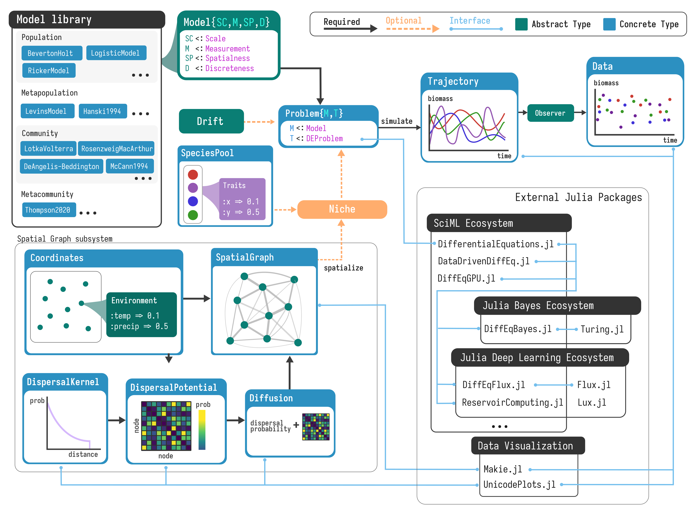
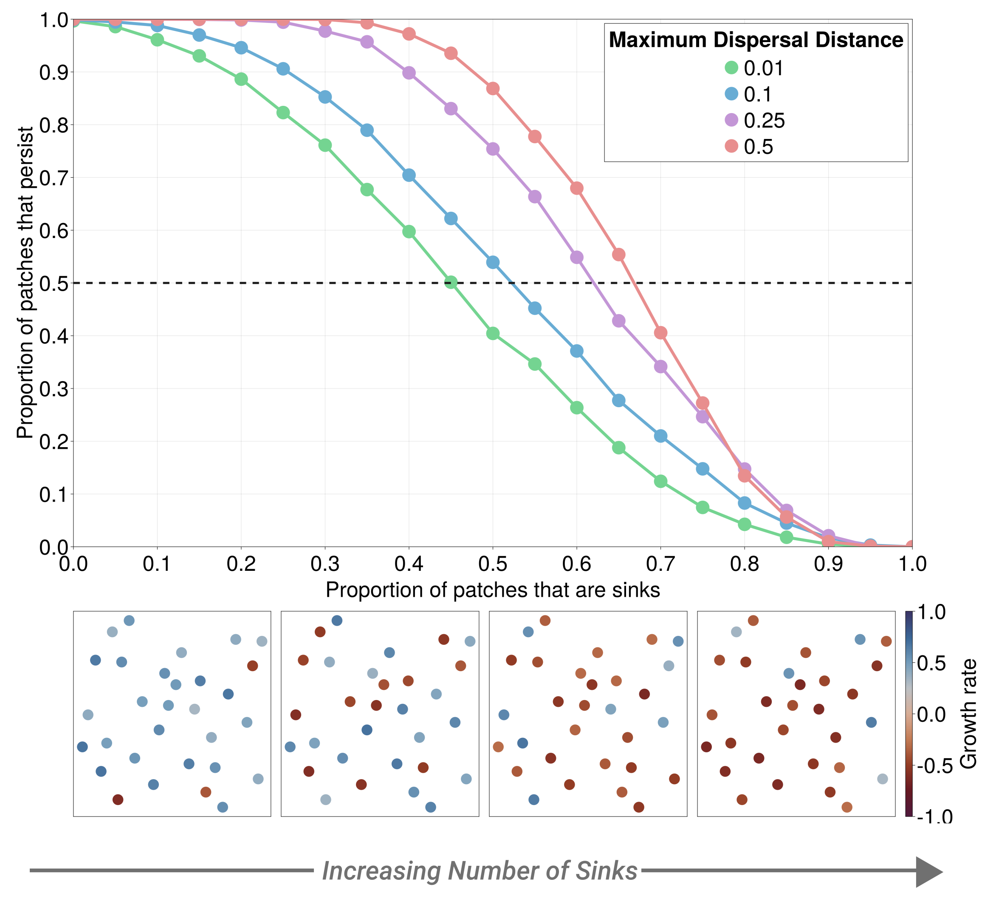

# Abstract

Ecosystems are often modeled using differential equations.

Platform for simulation of both determinsitic and stochastic models of
population and community dynamics, either at a single location or across a
spatial graph with environmental variation. 

Built on DifferentialEquations.jl, a state-of-the-art library for DEs. 

Enables inferences of dynamics. First Bayesian inference of DE parameters.

SciML.

# Introduction 

Ecosystems are inherently dynamic---the abundance and composition of different
species at a different places is constantly changing over time. 

The study of the stability of dynamical systems over time has deep connections
with the modeling of ecosystem dynamics, e.g. the study of chaotic dynamics
emerged from @May1972's model of the logistic map undergoing a fork bifurcation
under increasing growth rates.

Models that describe how ecological systems at population, community, or
ecosystem levels over time (_ecosystem dynamics_, henceforth) typically
take form of differential equations [@Lotka, @Volterra] (where time is
continuous) or difference-equations [@May] (where time is discrete). 

These classic models aren't perfect---they are abstractions. In reality, 
species abundances inherently changes over time as a result of stochastic
processes, both selective and random, combined with dispersal [@Velland2010ConSyn]. 

Here, we showcase `EcoDynamics.jl`, a software toolkit for simulating a wide
variety of models of population and community dynamics, both in isolation and as
reaction-diffusion dynamics on spatial-graphs. `EcoDynamics` enables both
deterministic and stochatic dynamics, and has the potential for environmental
covariates associated with nodes in the spatial graph to affect demographic
parameters, enabling virtual experiments about the effects of spatial
environmental variation on population and community processes.

EcoDynamics.jl includes a rich library of models of population and community
dynamics from the literature, and enables easy addition of customized models.

This toolkit is built upon DifferentialEquations.jl [@cite], a library for
ordinary and stochastic differential equations.

Why is this integration important?
- Orders of magnitude faster than deSolver, for example. 
- Native integrations with other Julia packages for inference.
- Turing.jl for Bayesian inference of parameters 
- SciML, DiffEqFlux for PINNs
- Arbitrarily complicated models of stochasticity.

Development of Scientific Machine-Learning [SciML; @Rackauckas2021UniDif]. 
Combine mechanistic, domain specific models (in the form of DEs) with
data-driven models (neural networks).  

Major angle: simulation of observing dynamics is important. We can never observe
ground truth in nature. So, we never know if our statistical analyses we employ
would be capable of capturing an effect if it was real. We can attempt to
estimate this using power analysis, but simulation provides us a case where we
can have a 'virtual laboratory' [@VolkerGrimm] which can provide "ground-truth"
that we use. Quite common in physical sciences: test your analysis software on
simulated data to make sure it works _before_ you try using it with real data. 

# Software Design

## Overview

ere we overview the design and usage patterns in EcoDynamics.jl.

{#fig:design}

- dispersal kernel
    - dispersal potential as a concept 
    - diffusion matrix

## Model index

Note that all `Population` and `Community` models can be run on spatial graphs.

| **Scale**      | **Name**                   | **Time**            | **Aliases**           | **Reference**  |
|----------------|----------------------------|---------------------|-----------------------|----------------|
| Population     | Logistic Model             | Continuous          | -                     |                |
| Population     | Beverton-Holt              | Discrete            | -                     |                |
| Population     | Ricker Model               | Discrete            | -                     |                |
| Population     | SIR Model                  | Discrete            | -                     |                |
| Community      | Trophic Lotka-Volterra     | Continuous          | -                     |                |
| Community      | Rosenzweig-Macarthur       | Continuous          | LV w/ Holling Type II |                |
| Community      | Holling Type III           | Continuous          |                       |                |
| Community      | DeAngelis-Beddington       | Continuous          |                       |                |
| Community      | Yodzis-Innes               | Continuous          |                       |                |
| Community      | Competitive Lotka-Volterra | Continuous          |                       |                |
| Metapopulation | Levins Metapopulation      | Continuous/Discrete |                       |                |
| Metapopulation | Incidence-Funciton Model   | Discrete            |                       | [Hanski1994]   |
| Metacommunity  | Neutral Model              | Continuous          |                       | [Hubbell2001]  |
| Metacommunity  | Process-based Competition  | Discrete            |                       | [Thompson2020] |

# Case studies 

Here we consider a few vignettes of how EcoDynamics.jl can be used. 

The first focuses on its use for simulation.

The second focuses on its use for inference. First Bayes, second using
Scientific Machine-Learning. Taking inspiration from
Physics-Informed-Neural-Networks (PINNs), we propose an
"Ecology-Informed-Neural-Network" (EINN) model that can account for a lack of
knowledge about the functional response in a consumer-resource system. 

## Measuring the inflationary effect and max dispersal distance

The inflationary effect [@Gonzalez2002]. Sources and sinks [Pilliam1988].

We measure how many patches persist over time as the number of patches that are
sinks increases. The strength of the inflationary effect is a function of
connectivity, particularly maximum dispersal distance. In spatially
autocorrelated environments, 

## Final: percolation of spatial graphs with max dispersal. Forcing params: max_distance and num_patches

This packages is as much about understanding the effects of connectivity and
environmental variation as the effects of connectivity on dynamics. Example of
phase-transition in connectivity as a result of the max-distance. 

Explain dispersal kernel. In the real world, there are intrinsic biological
constraints tat make dispersal beyond a certain distance have a probability of
effectively $0$. In a spatial graph, depending on how many patches there are and
where they are located, this means that there patches that are entirely
isolated, or small 'meso-populations' that interact with a few other patches, but
not the larger system as a whole (see fig TBD).

Introduce percolation problem. As the maximum dispersal distance of the species
in question changes, so does the topology of resulting spatial graph.

- In limit of infinite min distance and 0 decay, it should approach critical transition of largest component in ER graph.
    - How much does this diverge as function of alpha

## Bayesian inference of local community dynamics 

- Local community dynamics
    - Ease of integration with Turing for Bayesian inference of dynamics
    - It being built on DiffEq means easy integration w/ SciML. 

## Accounting for 'missing-ecology' using ecology-informed neural networks

Here we showcase one of the best advantages of EcoDynamics being built on the
SciML software ecosystem. 

### Scientific Machine Learning and Physics-Informed-Neural-Networks

- What is SciML?
- What are PINNs? 
    - Widely used for PDEs with nonlinear behavior. 
    - Turns out, when you train this on whole time-series, this causes issues.  
- What is difference between NeuralODE (NODE) and UniversalODE (UODE)?
    - NeuralODE [@Chen2018], 
    - UODE [@Rackauckus], NN is the residual 
- Multiple shooting. Similar to [@VictorBPaper] which found this method also
    improves fitting of NeuralODEs in ecology.

### Infering a functional response using Ecology-Informed-Neural-Networks

Lets say we know some simple, but incomplete, biological information about each
species in a consumer-resource system. We'll assume the resource exhibits some
form of density dependent growth, and mortaility as an unknown function $f$ of
the product of the amount of consumers and resource, $f(CR)$. Together this
means we believe the derivate $\frac{dR}{dt}$ should be proportional to these
values, i.e.

$$\frac{dR}{dt} \propto  R(1-R) - f(CR)$$

Similarly, for the consumer we assume it growths proportional to $f(CR)$, and is
subject to linear mortality, i.e. 

$$\frac{dC}{dt} \propto f(CR) - R$$

We want to build a EINN that maps values that we know are important in governing
the dynamics of this system ($C, R(1-R), CR$). In principle we could use a NN
that maps from $[C,R]$ to the pair of derivatives $[\frac{dC}{dt}
\frac{dR}{dt}]$, and via the universal approximation theorem, with enough first
layer width we could approximate the true $[\frac{dC}{dt}
\frac{dR}{dt}]$ to an arbitrarily small error [@citeUAT]

$g(\vec{x}) = \sigma(W_3 \cdot \sigma (W_2 \cdot \tanh(W_3 \cdot \vec{x})))$

{#fig:einn}

{#fig:einn_fit}

The thing is, inputs aren't limited just to this type of species information,
they can also include arbitrarily many environment coviarates that can vary
across space and/or time. This worked for forecasting covid with neural-ODEs [@Nunez2023ForVir]

Nonlinearity requires more data. 

- Alternative to [@BoettigerPaper]

# Discussion

Comparing different simulated models of dynamics to empirical data is useful.
- This enables stiatistical comparison of potential models for producing a given sampled dataset. 

- Deep learning for forecasting. MCMC estimate of parameters given true model is
  ideal [BoettigerPaper]
- SciML and forecasting. Fill in "missing physics/ecology" to determine what the
  _true_ dynamics are

# Acknowledgements

- Victor B
