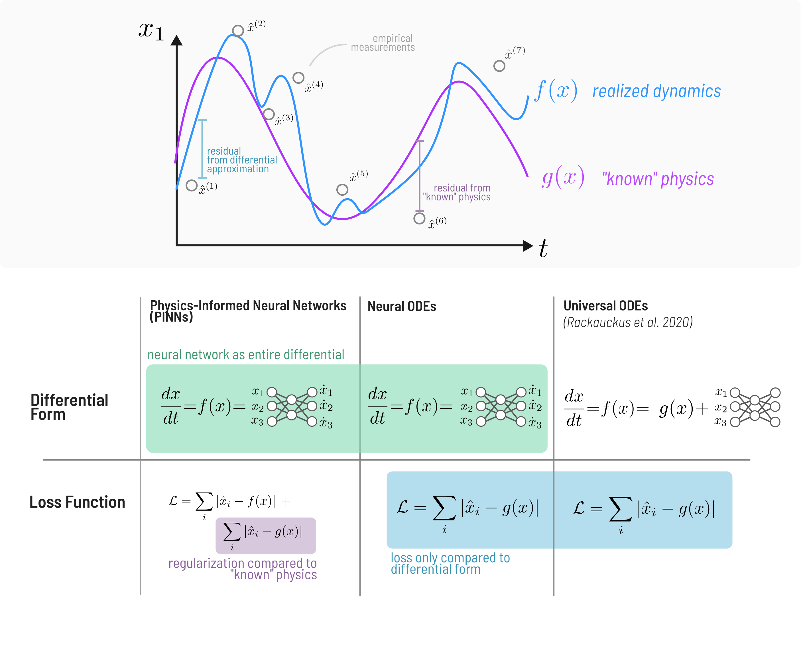

# Introduction 

Ecosystems are inherently dynamic---the abundance and composition of different
species at different places are constantly changing over time. Understanding how
assemblages of species interact, change, and persist over time is one of the
foundational goals of ecology as a science. At the same time, humans are
radically impacting ecosystem dynamics through land-use and climate change, and
adapting to and mitigating this change is essential to maintain the ecosystem
services humanity relies upon  [@Cardinale2012BioLos]. Being able to detect
changes in biodiversity, attribute them to human and natural drivers, and
forecast their future dynamics is crucial to maintaining biodiversity and the
services it provides to humans [@Gonzalez2023FraDet]. However, ecosystems are
perhaps the prototypical example of a complex adaptive system
[@Levin1998EcoBio], meaning their dynamics are the product of a vast number of
interconnected processes, many of which are inherently latent. If that were not
enough, sampling of ecosystem dynamics as it exists is inherently incomplete and
sparse in both space and time [@Hughes2021SamBia]. These factors together make
the inference and forecasting of ecosystem dynamics quite difficult, imposing
intrinsic limitations on prediction [@Beckage2011LimPre; @Pennekamp2019IntPre;
@Petchey2015EcoFor]. Still, reliable forecasts of biodiversity and ecosystem
dynamics are essential to guide decisions dedicated to mitigating and adapting
to this change [@Urban2016ImpFor].

This need has resulted in efforts to develop a Global Biodiversity Observation
System (GBiOS; @Gonzalez2023GloBio), modeled off of the Global Climate
Observation System (GCOS). Part of the success of GCOS can be ascribed to its
widespread adoption of standards and unified methods for modeling. There have
been similar proposals for a unified modeling platform for biodiversity
[@Urban2022CodLif], though this is largely impeded by the culture of ad-hoc
model development and poorly adopted standards for data formatting and
availability [@Poisot2019EcoDat]. A further difficulty is that in ecology, we
also have no universal governing equations of ecological dynamics. Though there
is universality in the fundamental forces driving the abundance and distribution
of species across space [@Vellend2010ConSyn], these forces can manifest
themselves in different ways, e.g. different types of functional responses in
consumer-resource systems [@Holling1966FunRes]. So although the processes are
universal, the balance of each of these processes manifested in a particular
natural system is always going to be latent and require inference from data.
This raises many questions: if we collect a time-series of a consumer-resource
system, how then do we decide which functional response is “best” to forecast
these species into the future? How can we be sure our data is even sufficient to
distinguish between different dynamic regimes in the first place? What is the
forecasting horizon for different ecological and evolutionary processes? And how
do we ensure we propagate the uncertainty in our data into our projections to
best inform decision making? These questions become even more complex when we
consider that all ecological processes take place across space, where dispersal
and heterogeneity in environmental conditions further complicate how these
dynamics unfold. 

Biodiversity data is inherently sparse and biased [@Hughes2021SamBia], and this
can lead to misleading or outright wrong conclusions due to underpowered
statistical inference [@Leung2020CluCat]. In many scientific and engineering
fields, it is standard practice to test any tools used for inference on
simulated data before applying them to real data. This assures our inference is
a robust reflection of the data and not providing erroneous results due to bugs
in the inference code, or underpowered samples leading to either type-i or
type-ii error. When using simulated data, we are sure of the “ground-truth”
processes and known level of measurement error behind the data, so we can assess
how well the given method is by comparing its inference to the known values
(Figure @fig:inference). This is especially important for ecology, where our data is
inherently sparse---Earth’s biosphere is very large and complex, there are
millions of species undergoing dynamics in space and time, and we can only
sample tiny snippets in time. The extent to which monitoring programs can cover
all of this is limited practically by funding and human resources and time. The
data we can collect is further biased by the spatial locations it was collected
and unavoidably contains measurement error.  We can never be certain of the
“ground truth” driving community dynamics in nature. So, after collecting a
dataset, we can never know if our statistical analyses we employ would be
capable of capturing an effect if it was real. Typically power-analyses used to
address this problem (e.g. @Green2016SimPac) relate sample size to properties of
the statistical model itself (i.e. the probability of capturing a ‘significant’
effect in a linear model), rather than being based on the underlying mechanisms
that generate the data (although see @Tucker2021EffSam as an example). 

![Conceptual figure outlining the benefits provided from _in silico_ power analyses on mechanistic models. In the top left, we see the pipeline from which known “ground truth” statistical effect $\beta_i$ becomes data in both the real world and in a simulated context. On the top right, we see the resulting information when data is obtained from the real world as opposed to repeated _in silico_ simulations. In the case of _in silico_ simulation, we have full information about the generating process, the sampling process (note the 3 sampling designs (bottom) involve the same number of total sampling events), and the amount of observational bias (in terms of both measurement error and temporal sparsity).](./figures/in_silica_power_analysis.png)

Ecological processes are influenced by structured and random variation in the
environmental conditions across space and time. The metacommunity framework
[@Leibold2004MetCon] enables us to simultaneously consider the effects of the
local environment, competition within populations, interactions between species,
and dispersal of different species across space. The balance of the fundamental
processes of demographic selection, drift, dispersal, and speciation
[@Vellend2010ConSyn] leads to qualitatively distinct metacommunity paradigms
[@Thompson2020ProMet].  Central to metacommunity theory is the abstraction that
a landscape can be modeled as a set of discrete habitat patches connected via
dispersal. The spatial graph framework allows us to apply tools from graph
theory to understand landscape connectivity [@Dale2010GraSpa] and to model the
heterogeneity in dispersal among species [@Albert2017AppNet; @Savary2023HetDis].
More generally, this enables us to represent metacommunity dynamics as dynamics
on a network of networks, where within each spatial node there is a network of
species, and the edges of the spatial graph model dispersal for each species
[@Hutchinson2019SeeFor; @Pilosof2017MulNat].

Here, we present  `EcoDynamics.jl`, a software toolkit for simulating a wide
variety of models of population and community dynamics, both in isolation and as
reaction-diffusion dynamics on spatial-graphs. EcoDynamics.jl enables both
deterministic and stochastic dynamics, and has the potential for environmental
covariates associated with nodes in the spatial graph to affect demographic
parameters, enabling virtual experiments about the effects of spatial
environmental variation on population and community processes. EcoDynamics.jl
includes a rich library of models of population and community dynamics from the
literature, and enables easy addition of customized models. This toolkit is
built upon DifferentialEquations.jl [@Rackauckas2017DifJl], a high-performance
library for ordinary and stochastic differential and difference equations---this
integration enables differential equation solvers orders of magnitude faster
than e.g. deSolver in R [@Rackauckas2017DifJl; @Rackauckas2019ConMod]. This also
enables integration with other parts of the Julia ecosystem: Turing.jl
[@Ge2018TurLan] or STAN.jl for Bayesian inference of differential equation
parameters, and integrations with the rapidly burgeoning Scientific
Machine-Learning (SciML) ecosystem [@Rackauckas2021UniDif], which enables
inference by combining mechanistic, domain specific models (in the form of
differential/difference equations) with data-driven models (neural networks) to
account for and discover missing dynamics in complex systems [@Chen2019RevCom;
@Cranmer2020DisSym; @Martin2018RevEco].

Aside from the sheer technical merits and advantages, EcoDynamics.jl also aims
to serve as a platform that changes how we think about inference from data in
ecology. When doing power analyses independent from the underlying mechanistic
process, we lose important details about the underlying process generating the
data, which is particularly relevant in planning the spatial and temporal
aspects of sampling design. EcoDynamics.jl provides a “virtual laboratory”
[@Grimm2013IndMod] for generating synthetic data under known conditions to aid
in the planning and design of monitoring programs and the testing of scientific
software for inference. We first provide an overview of the design of
EcoDynamics.jl, and then explore a glimpse of the potential uses of the software
using case-studies.  

# Software overview

Here we overview the design and common usage patterns in EcoDynamics.jl. 

## Why Julia?

Why write this library in Julia? It is true that Julia is not the most-adopted
language among ecologists, although it offers several advantages for building a
package with the design goals of EcoDynamics.jl. Julia is designed for
scientific computing, and offers the syntax of a high-level language with the
performance of a low-level, compiled language [@Bezanson2012JulFas]. A common
pattern in developing software for scientific purposes is to first develop a
prototype of the software in a high-level interpreted language (e.g. Python, R),
and then to develop a second version for use at scale in a statically typed,
compiled language (like C++ or FORTRAN). 

These latter languages tend to have much higher performance and therefore for
the many computationally intensive methods used in scientific computing, it is
worth making the effort to port software into these more complicated languages.
However, there is also a large downside here: languages like C++ are far less
known among scientists (and particularly ecologists), and as more of the
codebase used by scientists are written in lower-level languages, they can
easily customize software for distinct purposes. The decreased extensibility of
software tools caused by this two-language problem leads to bad outcomes:
duplication of code and therefore effort, and furthers the proliferation of
tools that use slightly different methodologies and standards to accomplish the
same goal. Julia aims to solve the two-language problem by providing a language
that is written like a high-level language, but uses a technique called
just-in-time (JIT) compilation to compile Julia syntax into machine code that
executes just as quickly as compiled C++.

The second reason is Julia’s state-of-the-art ecosystem for differential
equations. Over the previous several decades of research in numerical computing
methods for differential equations, many advances have been made for improving
the speed, stability, and accuracy of the numerical integration methods.
DifferentialEquations.jl provides a large library to modern integration methods
and automates selection of the appropriate method based on the model
specification [@Rackauckas2019ConMod].

## Design Principles 

While EcoDynamics.jl enables simulation of dynamics in a single place (locally),
its main goal is to enable reaction-diffusion models on spatial graphs.
EcoDynamics.jl is perfectly adequate for simulating the dynamics of
single-species systems, the core design goals are motivated by simulating
communities on spatial graphs, where environmental variation across each
patch/node can independently influence the dynamics of each species. The design
was also based around a particular emphasis on studying regime shifts in the
resulting composition of species across space at different levels of neutral,
niche, and dispersal processes. Using spatial graphs enables environmental
heterogeneity via arbitrary environmental predictors and covariates, and
explicit interspecific variation in response to the environment via
species-specific traits.  


EcoDynamics.jl leverages Julia’s type system and multiple-dispatch system to use
a common interface for constructing and running models. Models are built by
calling them like a function, e.g. `RosenzweigMacArthur()`, `Hanski1994()`,
etc., where parameters can be passed as named keyword arguments. Then, the
pattern for constructing and running models follows the typical form (using
Rosenzweig-MacArthur consumer-resource dynamics as an example): 

```
rm = RosenzweigMacArthur()
prob = problem(rm)
trajectory = simulate(prob)
```

Multiple-dispatch is a feature of the Julia language that enables the same
function name (e.g. `problem` or `simulate` above) to have different behavior
based on the _type_ of the inputs it is passed. This feature can be used in
layers: for example, `problem` first _dispatches_ (in the parlance of the Julia
language) on the properties of models (described in the below section) which
then pass specific objects and functions that enable the variety of models
included in the library.

Why do we need a package for this purpose? This is the meta-question that
underlies this manuscript. Why build a tool to do this---how much utility is
gained by having a prewritten set of tools for reaction-diffusion dynamics on
spatial graphs as opposed to an interested user implementing it from scratch?
There is a fundamental point to be made about all (good) scientific software
here: it should never be harder for a user, regardless of programming experience
in a particular language or in general, to learn to use a package to do
something than it would be to write code to do that something from scratch. If
this is not the case, the package is either unnecessary, bad, or both. What,
then, should a good package accomplish? (1) Minimum friction from going to
nothing to a minimum working example. This is where first impressions are made,
and first impressions count a lot in software. (2) Documentation matters a lot,
but that isn’t something I can address in this paper outside of linking to it
and saying “it has good documentation”. (3) Standardization of tools and
methodology. If a particular abstraction for modeling a system is common enough,
there is going to be a ton of wasted effort in the duplication of code for the
same purpose, and it becomes more likely that some instances of this duplicated
code will contain bugs. wIf many people are compelled to build the same thing
independently, there is clearly some level of community demand for it. The point
of open-source software is that the interface can be adapted to make the most
sense to the most people. I think there is a sizable research community that
wants to be able to run models like this without having to build the entire
thing from scratch. There are arguably similar tools that exist, e.g.
rangeshiftr, but these tools are limited in their extendability. One of the core
design goals is extensibility first, and that should make this appealing to the
general community of researchers interested in these types of models. 

Finally, one of the core goals of EcoDynamics.jl is to be extendable---that is
it will almost always be easier for a user to add a new model or additional
feature than to rewriting a new set of tools to reaction-diffusion dynamics on
spatial graphs with the desired model/feature. EcoDynamics.jl manages this by
providing a uniform API for all models in the library, and extending a model is
as straightforward as defining the model `struct` and implementing the `∂u`
method describing the rule to update from one timestep to the next. Extra
methods for plotting and other utilities are optional, and are not required to
get a model running from scratch.  

## Package Design 

![Overview of the design of EcoDynamics.jl. Top left: the model library, which provides `Models` which can be turned into `Problem`s with the `problem` method (along with optional `Drift` inputs, and `niche` functions). Bottom left: the spatial graph subsystem, which takes a set of coordinates and a dispersal kernel to produce a diffusion matrix that models dispersal on a spatial graph. Bottom right: the external libraries in the Scientific Machine-Learning (SciML) ecosystem, the deep learning ecosystem, and the Bayesian inference ecosystem](./figures/design.png){#fig:design}

### Models

Every model in EcoDynamics is associated with four properties that provide
instructions to the package internals on how to simulate it. The first is the
*measurement*, or the type of state space the model takes place in (biomass,
abundance, and occupancy are what is currently supported). The second is the
model's *scale* (population, community, metapopulation, or metacommunity)---note
that this refers to the scale that a model was originally defined at, e.g.
Lotka-Volterra is always a `Community` scale, regardless of whether it had been
made spatial with `spatialize`. The third is the *temporal domain*, i.e. whether
the model exists in discrete or continuous time. Finally, there is
*spatialness*, which describes whether a model is associated with a spatial
graph or is only at a single location.

### Spatial Graphs and Reaction-Diffusion Models

Modeling patchy landscapes with spatial graphs has proven a useful abstract in
ecology [@Dale2010GraSpa]. Although explicitly discretized Euclidean space has
been used in ecological model (e.g. @Hastings1978GloSta), the complexity induced
by this model of space, as well as the difficulty of adequate describing spatial
heterogeneity in this framework, often makes the computational costs with this
type of model not worth the benefit. In contrast, spatial graphs that explicitly
represent heterogeneity in the environment and in dispersal have widespread
utility in ecological modeling [@Hutchinson2019SeeFor; @Savary2023HetDis] and
conservation [@Albert2017AppNet]. Spatial graphs can easily be adapted to
simulate spatial ecological dynamics by adapting the reaction-diffusion
framework [@Okubo1978DifEco], which is widespread for modeling processes with
both spatial and local components across a wide-variety of domains, and which
originated in its modern form for biology specifically (Turing’s model of
morphogenesis; @Turing1952CheBas). 

Reaction-diffusion dynamics follow the form

$$\frac{d\vec{N}}{dt} = g(f(\vec{N}))$$

where $\vec{N}$ is a vector where each element is a (not necessarily a scalar)
measurement associated with each site, $f$ is a function that describes the
local dynamics and applies that same transformation to each element of
$\vec{N}$, and $g(\vec{N})$ is a function that describes diffusion across space. 

More specifically, in spatially continuous models of ecological dynamics (e.g.
@Hastings1978GloSta), where
each spatial location has a two-dimensional coordinate $\vec{x} = (x_i, y_i)$
associated with it, $g(x)$ is the Laplacian operator

$$g(\vec{N}) = D_i \nabla^2 N_i = D_i \frac{\partial^2 N_i}{\partial^2\vec{x}}$$

where $D_i$ is a diffusion coefficient associated with each species. 

Analogously, reaction-diffusion dynamics can be described for spatial graphs by
utilizing the Laplacian as it is defined on graphs---the matrix 
$\mathbf{L} = \mathbf{K} - \mathbf{A}$, where $\mathbf{K}$ 
is a matrix with the degree of each node $k_i$ on its diagonal, and $\mathbf{A}$
is the adjacency matrix [@Gibert2019LapMat]. The topology of the spatial
graph can reveal considerable information about how the dynamics will unfold
across space---the eigenvalue spectrum of the Laplacian governs key properties
of the realized spatial dynamics [@Gibert2019LapMat].

A common method to describe dispersal probability between patches/nodes is using
a dispersal kernel---a function $k$ that maps a physical distance $d$ to a
probability that an individual will successfully disperse that distance. We
propose a modification to dispersal kernels that makes them more naturally
suited to diffusion dynamics on a graph. For each node in the spatial graph $i$
at coordinate $x_i$, we first compute the dispersal kernel matrix for each pair
of patches, $K_{ij}$ as


$$K_{ij} = \begin{cases}
    k(|x_i - x_j|) \quad\ &\text{if}\ |x_i - x_j| < \epsilon \\
    0 &\text{else}
\end{cases}
$$

where $\epsilon$ is the maximum dispersal distance of the organism, and then
renormalize across each row (where $i$ is the source of dispersal) to produce the
dispersal potential $\Phi_{ij}$ as 

$$\Phi_{ij} = \begin{cases}
    \frac{K_{ij}}{\sum_k K_{ik}} \quad\ &\text{if}\ \sum_k K_{ik} > 0 \\
    0 &\text{else}
\end{cases}
$$

This forms a categorical distribution for each node/patch $i$ that describes
where individuals successfully dispersing from that patch are going to end up.
To turn this into a full-fledged reaction-diffusion model, we need one more
step, which is the probability that any given individual disperses durings its
lifetime, $m$. This final step allows us to construct the diffusion matrix $D$
as

$$D_{ij} = \begin{cases}
    m_i \Phi_{ij} &\text{if}\ i\neq j \\
    0 &\text{if}\ i =j
\end{cases}
$$

which is a stochastic matrix (for each source patch $i$, the values over all
possible targets $j$ forms a distribution), ensuring conservation of mass in the
system. From this we can construct our diffusion functio $g(x_i)$ for each
species $i$ as  

$$g(x_i) = D_{(i)}^T f(N_i)$$

where $f(N_i)$ describes local dynamics.

### Environmental heterogeneity 

EcoDynamics enables heterogeneity in the environment by enabling covariates of
arbitrary type to be associated with each node. Covariates can be ascribed to
each node by providing a raster in the same spatial coordinate system, drawing
randomly from a known distribution, generated via NeutralLandscapes.jl, or
assigned manually. These environmental covariates have the potential to affect
ecological dynamics when paired with a user provided `niche` function, which
maps environmental covariates to unique values of the parameters for the
dynamics model in each node/patch. 

### Inter-specific variation 

Another crucial component to many models of community dynamics is variation in
traits among species, which can affect both their impact on other species and
effect of environmental conditions on dynamics. To accommodate for these effects
in EcoDynamics.jl, we use a data type called `SpeciesPool` to store these trait
values. As an example, in @Yodzis1992BodSiz, variation in the body-size is a
crucial parameter required by the model. For this and similar models, a
`SpeciesPool` is required as given a default value, but can be passed as a
custom input to the constructor. Species specific traits are also passed as
arguments to the `niche` function if it is provided as an input. This enables
interaction between species traits and environmental conditions, including the
possibility of more complex models of dynamics that include interactions between
traits and the environment. 

### Stochastic Dynamics

Ecological dynamics are inherently stochastic---there is randomness in the
variation of abiotic environmental conditions over time at different scales and
intrinsic variation in ecological processes [@Melbourne2008ExtRis].
EcoDynamics.jl enables arbitrarily complex models of stochasticity via the
state-of-the-art integrators for stochastic differential equations (SDEs)
included with DifferentialEquations.jl [@Rackauckas2020StaHig;
@Rackauckas2017AdaMet]. Similarly, within DifferentialEquations.jl discrete-time
models can be either deterministic or stochastic, without using different
integration algorithms.

### Observation Models

Crucial to one of the core design goals of EcoDynamics.jl --- providing “ground
truth” dynamics to benchmark inference methods --- is the ability to simulate
the process of observation and its associated error. The processes that
contribute to observation error in nature are numerous: there is of course
standard measurement error, where the observed value of a variable is some
amount different from the true value. But there are also biases imposed on data
based on where and when they are collected. This highlights the importance of
including a model of the observation process when doing power analysis using
mechanistic models.

# Case Studies

Here we present two sets of case-studies that demonstrate a variety of
functionality in EcoDynamics.jl. The first pair of case-studies focuses on the
spatial modeling features of EcoDynamics.jl, and the second pair focuses on
doing inference from data using interfaces to tools for both Bayesian inference
and Scientific Machine-Learning (SciML).   

## Phase transitions in the percolation of habitat connectivity

We begin by examining the effect of maximum dispersal distance, a trait with
important consequences for home and total range size [@Bowman2002DisDis; @Whitmee2013PreDis], on landscape connectivity, and demonstrate a sudden
phase-transition in the connectivity patchy landscapes. In the real world, there
are intrinsic biological constraints that make dispersal beyond a certain
distance effectively impossible. As the maximum dispersal distance of the
species in question changes, so does the topology of the resulting spatial
graph, depending on how many patches there are and where they are located, this
means that there are patches that are entirely isolated, or small
“meso-populations” that interact with a few other patches, but not the larger
system as a whole (figure 3). 

A classic result in network science is the phase transition associated with the
emergence of a “giant-component” in random Erdos-Renyi graphs [@Erdos1959RanGra;
@Newman2018Net]. In this case, a “giant-component” refers to a set of at least
half the nodes in the network that are connected via some path. A similar phase
transition occurs here as we increase the maximum dispersal distance of a
hypothetical species. In Figure @fig:percolation (left), we see the proportion
of patches that are connected via some path ("in the largest component”) as a
function of maximum dispersal distance, and find that this transitions becomes
increasingly critical as the number of patches increases---meaning the jump from
almost no patches being connected to nearly all being connected occurs
increasingly rapidly as soon as a critical threshold of maximum dispersal
distance has been reached. 

Each point in Figure @fig:percolation represents 512 random spatial graphs generated at that given maximum dispersal distance.  A single instance can be run with 

```
function run_instance(num_patches, max_dispersal_distance)
	dk = DispersalKernel(max_distance=max_dispersal_distance)
	sg = SpatialGraph(Coordinates(num_patches), dk)
	g = Graph(sg.potential .> 0)
	component_sizes = length.(Graphs.connected_components(g))
	return maximum(component_sizes)
end
```

which computes the size of the largest component of the spatial graph using the
Graphs.jl package.  


![Left: the percolation of habitat connectivity measured as the proportion of patches in the largest connected component (vertical axis) and the maximum dispersal distance of a hypothetical species (horizontal axis). Different colors indicate different numbers of patches---note that the transition to fully connected becomes more critical as the number of patches increases. Right: examples of different habitat networks under different maximum dispersal distances, emphasizing how this changes the resulting topology of the spatial graph.](./figures/percolation.png){#fig:percolation}

## Measuring the spatial inflationary effect as a function of dispersal distance 

A well-known phenomenon in patchy landscapes is that the inherent variation in
habitat patch quality can lead to some patches acting as “sources”, where the
intrinsic growth rate of a population is positive, and “sinks”, where the growth
rate is negative [@Pulliam1988SouSin]. The balance of both
sources and sinks determines the persistence of a metapopulation in a patchy
landscape, though this may not be as simple as a majority-rule decision. Here we
demonstrate that landscape connectivity plays a crucial role in determining
whether there is a “colonization-credit” [@Cristofoli2010ColCre] that enables
the metapopulation to persist, despite a minority of patches having positive
growth rate. This effect has been documented in a large number of systems
[@Bagaria2015AssCoe; @Duplisea2016ExtDeb; @Haddou2022WidExt; @Rumpf2019ExtDeb]
and is likely to be important to predict which species will be capable of
tracking their climatic niche over the coming century [@Talluto2017ExtDeb].

If the environmental conditions that give rise to “source” or “sink” behavior
are spatially autocorrelated, there may be a similar spatial analogue to the
inflationary effect [@Gonzalez2002InfEff]---where
temporal autocorrelation in environmental conditions can cause “sink” patches to
have greater expected abundance than if the patch experiences a constant
environment [@Matthews2007InfEff; @Roy2005TemAut].

To demonstrate this using EcoDynamics.jl, we simulate the Beverton-Holt model (a
stochastic, discrete-time model of population dynamics) for 250 generations
across spatial graphs with a fixed ratio of sources:sinks. We simulate 512
random spatial graphs, each with 50 patches, at each value of the proportion of
patches that are sinks, ranging from 0 to 1 (Figure 4). This vignette highlights
the integration between NeutralLandscapes.jl and EcoDynamics.jl, creating
spatial graphs with autocorrelated environmental conditions using the following: 

```
function make_graph(max_dispersal_distance)
    el = EnvironmentLayer(generator=MidpointDisplacement(0.8)) 
    coords = Coordinates(el)
    sg = SpatialGraph(coords, DispersalKernel(max_distance=max_dispersal_distance)) 
end 
```


This provides a spatial graph with an environmental covariate associated between
0 and 1 with each patch (called `x` by default). The underlying environmental
variable is generated using the `MidpointDisplacement`` neutral landscape generator
from NeutralLandscapes.jl, and takes $H = 0.8$ as a parameter controlling spatial
autocorrelation.  

To relate this environmental covariate to the dynamics that occur in each patch,
we define a `niche` function  

```
function niche(model, traits, local_env)
    θ = paramdict(model)
    θ[:R₀] = (cutoff - local_env[:x])
    return θ
end
```

We find that as the maximum dispersal distance (colors in Figure 4) increases,
the proportion of patches that are able to persist when exactly half of the
patches are sinks (and the other half are sources; 0.5 on the horizontal axis of
Figure 4), the “surplus” number of patches above half that are able to persist,
despite having negative growth rate, increases. 


{#fig:inflation}

## Bayesian Inference of Consumer-Resource Dynamics

The second pair of case studies deal with scenarios where we have a time-series
of observed dynamics, which are potentially quite sparse in time and subject to
lots of measurement error. In this case, we are solving the inverse problem [@Stouffer2019AllEco]---going from a set of observations to inference about the
parameters underlying the generating process. In both examples, we will deal
with the dynamics of a Rosenzweig-MacArthur (RM) consumer-resource model, given
by the equations


\begin{align*}
\frac{dR}{dt} &= \lambda R \bigg(1 - \frac{R}{K} \bigg) - \frac{\alpha CR
}{1-\alpha \eta R} \\
\frac{dC}{dt} &= \beta \frac{\alpha CR}{1-\alpha \eta R} - \gamma C
\end{align*}


Note that this is effectively resource logistic growth with consumption given by
a Holling Type-II functional response. The RM system is particularly well
studied as it undergoes a Hopf-bifurcation as the value of $K$ increases (Roos
2023; Rosenzweig 1971), moving from a place where both abundances approach a
stable spiral fixed point, to a point with permanently oscillating limit cycles.
As K continues to increase beyond the Hopf bifurcation point, the amplitude of
the oscillations for both species increases---in real systems this destabilizes
dynamics as the increasing amplitude of each species’ oscillations means points
in the trajectory get closer and closer to extinction (zero abundance), and as a
result this system is often cited as defining the “paradox of enrichment”.   

We infer the parameters of this system using a simple interface from
EcoDynamics.jl to  to Turing.jl, a Julia library for Bayesian inference and
probabilistic programming (Note that there are also interfaces to STAN using
DiffEqBayes.jl or STAN.jl). The results of this inference are shown in Figure
@fig:bayes_inference. Note that although this is fairly effective at learning
the true parameters and resulting dynamics from sparse, noisy data, this comes
with a large modeling trade-off, which is that we must a priori specify that we
believe that the underlying dynamics follow the Rosenzweig-MacArthur form. We
are, of course, free to fit this data to a wide-variety of functional forms of
consumer-resource dynamics and apply model selection techniques (e.g. AIC, MDL)
to select which form most effectively describes our data, though the scalability
of this approach begins to break down when confronted with larger food-webs with
potentially heterogeneous functional responses between different species. 

{#fig:bayes_inference}

## Accounting for “missing-ecology” using ecology-informed neural networks

### Scientific Machine Learning and Physics Informed Neural Networks 

In many complex systems, and ecology especially, the true form of the underlying
dynamics are not fully known. This problem has led to novel approaches that
integrate machine learning with conventional differential equation models of
systems to capture “unknown” or “missing” parts of the models. Specifically in
fluid-dynamics, this practice has led to much research interest in statistical
methods for accounting for the inherent sparsity of data in many
high-dimensional non-linear systems and learning efficient representations of
their dynamics [@Brunton2016DisGov]---the general approach being to find a
coordinate basis that enables simpler representation of the underlying dynamics
than in a Cartesian basis. Moving beyond typical statistical approaches to
accomplish this same goal, Physics-Informed-Neural-Networks (PINNs) are used to
combine mechanistic physical models with neural networks. This research has led
to development of many similar but distinct models---both Neural ODEs (NODEs,
@Chen2018NeuOrd, @Dandekar2022BayNeu) and Universal ODEs (UODEs;
@Rackauckas2021UniDif).  

A brief summary of the differences is shown in Figure 4. The primary differences
are that PINNs include distance from the prediction of a physical law directly
in the loss function, which neither NODEs nor UODEs do. Both PINNs and NODEs use
a neural network to approximate the entire differential ($\frac{dx}{dt}=
\text{NN}(x)$), where the loss function only considers the distance from the
data, while, UODEs only approximate the residual between “known” dynamics and
data, i.e. $\frac{dx}{dt}=g(x) + \text{NN}(x)$, where $g$ is what is known a
priori about the equations governing the dynamics of the system. Note that UODEs
are a superset of NODEs, as setting the $g(x)$ term in a UODE to $0$ results in a
standard NODE (technically the formalism of UODEs makes them a superset of any
stochastic delay partial differential equation, though the details are out of
scope for this paper, see @Rackauckas2021UniDif for more information).  

Julia has one of the most mature ecosystems for SciML, enabling straightforward interfaces from the various software packages for SciML (DataDrivenDiffEq.jl, DiffEqFlux.jl, SymbolicRegression.jl, etc.) to EcoDynamics.jl. 



### Inferring a functional response using Ecology Informed Neural Networks

In this vignette, we demonstrate the integration between EcoDynamics.jl and the
Julia SciML ecosystem to fit a NeuralODE to data from the Rosenzweig-MacArthur
model. We demonstrate a result from @Boussange2022MinEco, which is that
capturing nonlinear dynamics using NeuralODEs is much easier when training NODEs
using a method called “multiple-shooting” (also referred to as “mini-batching”;
@Turan2022MulSho).  

The default perspective when training a NODE on a time-series is to compute a single loss value across all pairs of adjacent time-points, 

$$\mathcal{L} = \sum_{t \in \{2\dots N_t\}} |x_{t-1} - \hat{x}_t|$$

though this tends to undefit oscillatory dynamics [@Turan2022MulSho], which are
particularly common in ecological models. To address this, multiple shooting
fits the loss function by splitting the original time-series into many smaller,
shorter time-series, and evaluates the loss as a combination the sum of the loss
across all unique segments, and a separate term that evaluates the distance
between the end point of each segment and the start of the next one.   

![Demonstration of inference of the Rosenzweig-MacArthur consumer-resource system using a Neural ODE (NODE) using two forms of multiple shooting---17-shooting, where the original data (points) is split into 17 segments (left) and 2-shooting where the original data is split into two parts (right). The dashed line is the continuation of the true dynamics beyond the temporal cutoff for training. Note how breaking the time-series into longer portions causes the NODE to underfit by quickly approaching the long-term average of both time-series. ](./figures/node.png){#fig:sciml}
	

# Discussion 

Here we have showcased EcoDynamics.jl, a software package for population and
community dynamics on spatial graphs in the Julia language. This software
package includes a library of common models for both occupancy and abundance
dynamics, and an interface to easily add custom models. Further, EcoDynamics.jl
enables species traits and heterogeneous environmental conditions across patches
to influence dynamics, and includes methods for simulating observation error to
generate synthetic datasets for benchmarking and validation of models for
inference from time-series data. This is all built on top of
DifferentialEquations.jl, a state-of-the-art library for simulation of
deterministic and stochastic differential equations [@Rackauckas2017DifJl]. The
aim of this toolkit is to standardize methods for generating synthetic data, and
to serve as a “virtual laboratory” [@Grimm2005IndMod] for testing sampling
designs and inference tools in silico.  

The metacommunity concept has demonstrated its utility in scaling from local
community processes to describe the distribution and abundance of species across
space and time [@Leibold2004MetCon; @Leibold2017MetEco]. Metacommunity theory
is built around understanding the composition of species across heterogeneous
landscapes by treating them as networks of networks [@Hutchinson2019SeeFor]. A standardized toolkit for community dynamics on spatial
graphs is needed to better understand these systems, with the ability to rapidly
prototype “virtual experiments”, and to produce phase-diagrams of the
metacommunity paradigm (species-sorting, patch dynamics, mass effect, neutral; @Leibold2004MetCon) that result from the balance of the fundamental
mechanisms that govern community ecology [@Vellend2010ConSyn]. A downstream
requirement for this software to enable virtual experiments potentially
involving spatial heterogeneity, environmental perturbation, interspecific
variation in response to the environment, and so on, is that this toolkit must
be both flexible enough to enable custom extension, but also fast enough to
scale to large-scale batch simulation. 

We hope this is the foundation of developing a robust, standardized set of tools
for ecological dynamics in the Julia language. There is increased interest in
developing a “digital twin” for biodiversity [@Koning2023DigTwi], and it is
increasingly accepted that we will not be able to detect and attribute the
causes of biodiversity without sufficient monitoring and modeling tools
[@Gonzalez2023FraDet].

We have also demonstrated the potential utility of Scientific Machine Learning
(SciML;@Rackauckas2021UniDif) for learning complex ecological dynamics from
limited training data. Despite a wide variety of theoretical and applied
advances being made in this field over the last decade, its adoption in ecology
is slow, despite its potential [@Boussange2022MinEco; @Chen2019RevCom]. The
ability to mix mechanistic models with data-driven methods from machine learning
offers particular advantages in ecology, where there is often considerable
variation in data, even given a shared mechanism, due to the inherent
stochasticity of many ecological processes.


EcoDynamics.jl is built on two approximations: the spatial graph approximation
of patchy landscapes, and the reaction-diffusion approximation of dispersal.
These abstractions, like all abstractions in ecological modeling, are only valid
for a particular set of scales. One possible use of EcoDynamics.jl is to
validate these assumptions in comparison to simulation models designed around
smaller scales to determine when and why these approximations break down. For
example, diffusion may be an adequate approximation for dispersal if it is a
stationary process, but if the dispersal distribution is characterized by rare
events (i.e the distribution kernel is fat-tailed), then using the expected
value of that process at each timestep (as diffusion does) may not be a valid
assumption at all. Similarly, the spatial-graph assumption makes strong
assumptions about the quality of habitat that is not a core patch---namely that
it is inhospitable.

 Such models may not adequately represent that movement process of many
 organisms, but determining when this approximation is valid is essential to
 know when it is useful for making predictions and decisions in a conservation
 or management context. It is worth remembering that as scientists, we make
 approximations for a reason. When considering something as complex as an
 ecosystem, it can become tempting to imagine that the ontological validity only
 lies in the smallest scales, and that each approximation moves us further and
 further from ecological reality. Yet it is obvious that basing ecological
 models on the smallest scales possible is both computationally intensive enough
 to be impractical, and also unlikely to provide as much insight as it creates
 nearly as many problems as it solves---“Abstraction becomes destructive when
 the abstract is reified and when the historical process of abstraction is
 forgotten, so that the abstract descriptions are taken for descriptions of the
 actual objects...The problem for science is to understand the proper domain of
 explanation of each abstraction rather than become its prisoner” [@Levins1987DiaBio].
 
We conclude by reemphasizing the need for tools like EcoDynamics.jl to simulate
synthetic data for the purpose of testing and validating methods for inference
from data before they encounter data for which the true generating process is
unknown. Ecologists, and all other sciences, inevitably are faced with the task
of drawing inference from data that they wish they knew much more about. Real
data will always be shrouded in the uncertainty that we are unsure what the true
process(es) generating the data is, and that we can not be certain about how
biased our measurements are.  By using mechanistic models to simulate many
“possible worlds”, we can at least benchmark and validate the methods we use for
inference and get a reasonable expectation of the predictive efficacy of our
forecasts. This is essential if we are to produce forecasts that are not only
robust, but adequately reflect the uncertainty in their predictions [@Urban2016ImpFor]. 

